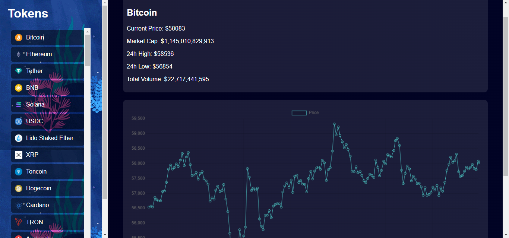

# oly_C_plorer

oly_C_plorer is a web application that allows users to explore various cryptocurrencies, view their current prices, market cap, and historical price data over different time periods. The project uses the CoinGecko API to fetch data and Chart.js to display historical price charts.

## Features

- Display a list of cryptocurrencies with their names and icons.
- View detailed information about a selected cryptocurrency.
- Display historical price data in a chart.
- Change the time period of the historical data (24 hours, 7 days, 1 month, 1 year, max).

## Screenshots



## Technologies Used

- HTML
- CSS
- JavaScript
- Chart.js
- CoinGecko API

## Setup

1. Clone the repository:

```bash
git clone https://github.com/yourusername/oly_C_plorer.git
```


2. Navigate to the project directory:
```bash
cd oly_C_plorer
```
3. Open index.html in your preferred web browser.

## Usage
- Open index.html in your web browser.
- Wait for the list of cryptocurrencies to load.
- Click on any cryptocurrency to view its details and historical price chart.
- Use the buttons to change the time period of the historical data.

## Code Overview
1. HTML
The index.html file contains the structure of the web application, including the container for the cryptocurrency list, the details section, and the chart canvas.

2. CSS
The styles are defined in style.css to ensure a visually appealing interface. The application has a dark theme with smooth transitions and responsive design.

3. JavaScript
The main functionality is implemented in script.js. This includes:
     - Fetching the list of cryptocurrencies from the CoinGecko API.
     - Displaying the list of cryptocurrencies.
     - Fetching and displaying detailed information and historical price data for a selected cryptocurrency.
    - Handling the time period change for the historical data chart.

4. Chart.js
Chart.js is used to display the historical price data in a line chart. The chart updates based on the selected time period.

5. API
The application uses the CoinGecko API to fetch data. You can find more information about the API from the original CoinGecko API documentation.

## Contributing
Contributions are welcome! Please fork the repository and submit a pull request with your changes.

## License
This project is licensed under the MIT License. See the LICENSE file for details.

## Contact
For any inquiries or feedback, please contact:

 - Name: Ntem, Kenyor K.
 - Email: nkenyor@gmail.com

## Demo

Watch a short [Youtube video](https://youtu.be/Vgmu4WedD88) demonstrating the explorer/dashboard.

## License

MIT License
